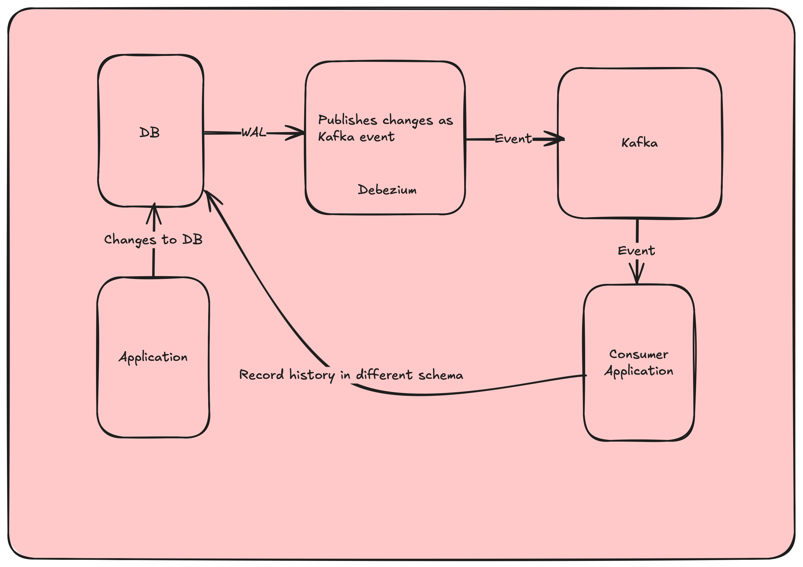

# History CDC
This project publishes database changes to Kafka using Debezium connector and is consumed by an application.

The main idea behind this project is to build history of a table into another schema while being decoupled from the main application.
As of now the changes to the database are produced as a Kafka event by Debezium and consumed by a Spring application to insert in history schema. However, we can probably leverage another Kafka sink component rather than building our own consumer

## Diagram
